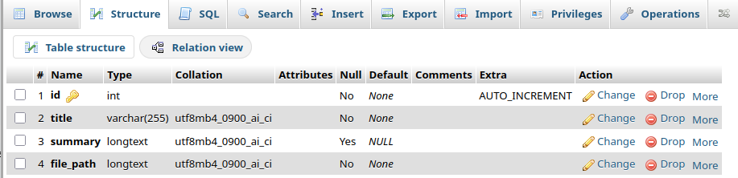
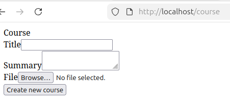
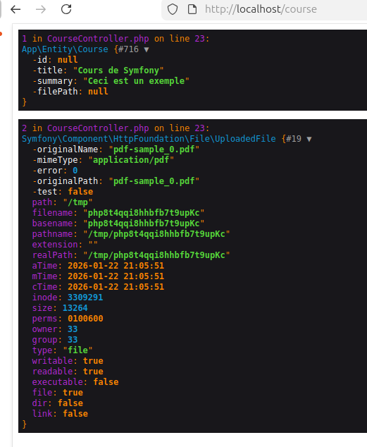
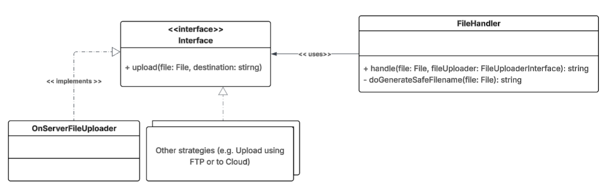
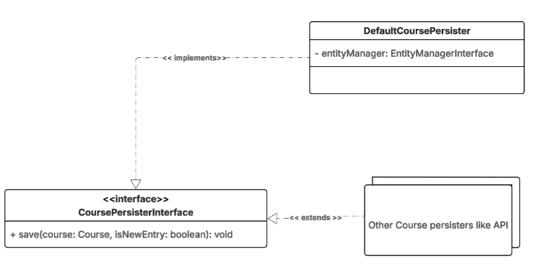
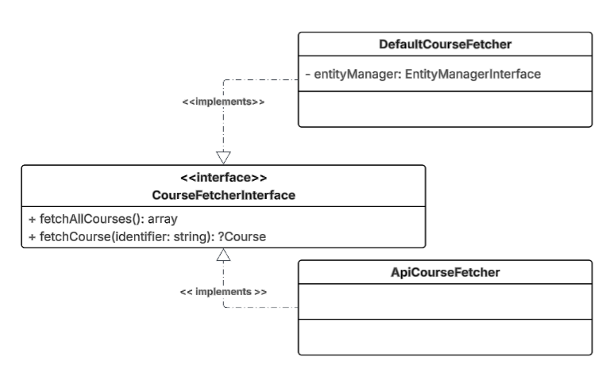
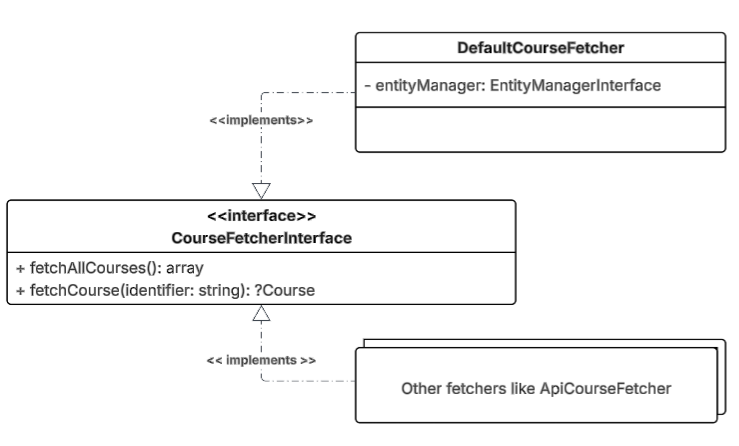

# Interaction avec la base de données

## But de l'exercice 

Le l'exercice est de concevoir un formulaire pour envoyer (Upload) un cours. Le support du cours doit être :

- soit Fichier PDF 
- soit fichier DOC ou DOCX
- soit un fichier PPT ou PPTX
- soit une image

Le fichier ne doit pas dépasser *10Mo* de taille.

De plus, le cours doit avoir :

- un titre
- une description ou résumé


Nous devons aussi avoir une page "bibliothèque" à travers lequel nous pouvons visualiser les cours, voir le cours et aussi télécharger le cours.

## L'entité 

1) Avant de commencer à créer le formulaire il va nous falloir créer l'entité `Course`. 

    Utiliser la commande `php bin/console make:entity Course` pour créer votre entité

    - title: string
    - summary: text (nullable)
    - filePath (le fichier à joindre avec le cours): text (nullable)

2) Mettre à jour la base de données: 

    - Créer votre migration : `php bin/console make:migration` 
    - Executer la migration : `php bin/console doctrine:migrations:migrate`

    

## Le formulaire

1) Créer le formulaire `CourseType` qui contiendra : 

    - Champ de texte pour saisir le titre du cours,
    - Champ de texte large pour saisir le résumé du cours, 
    - Champ pour charger le support du cours,

        les champs à utiliser sont disponibles sur [https://symfony.com/doc/current/reference/forms/types.html](https://symfony.com/doc/current/reference/forms/types.html)

        ```php
            use Symfony\Component\Form\Extension\Core\Type\FileType;
            use Symfony\Component\Form\Extension\Core\Type\TextareaType;
            use Symfony\Component\Form\Extension\Core\Type\TextType;


            public function buildForm(FormBuilderInterface $builder, array $options): void
            {
                $builder
                    ->add('title', TextType::class, [])
                    ->add('summary', TextareaType::class, [])
                    ->add('file', FileType::class, [
                            'mapped' => false,
                    ]);
            }
        ```
2) Ajouter la validation de ce formulaire:

    - Au niveau de `CourseType` , pour le champ `file` ajouter les contraintes suivantes:

        --> Champ doit être de type fichier 
        --> Les types autorisés sont à récupérer [ici](https://developer.mozilla.org/en-US/docs/Web/HTTP/Guides/MIME_types/Common_types)

        PDF : **application/pdf**
        Images : **image/png**, **image/jpeg**, **image/webp**
        Documents : **application/msword**, **application/vnd.openxmlformats-officedocument.wordprocessingml.document**, **application/vnd.ms-powerpoint**, **application/vnd.openxmlformats-officedocument.presentationml.presentation**  

    - La liste des contraintes à utiliser sont disponibles sur [https://symfony.com/doc/current/reference/constraints.html](https://symfony.com/doc/current/reference/constraints.html)

    - La validation de votre formulaire de être par vous. 

## Le Contrôleur  

1) Lancer la commande `php bin/console make:controller Course` pour créer le Contrôleur responsable pour la gestion des cours.

2) Créer le formulaire et afficher-le dans la template Twig. Le code doit ressembler à 

    ```php
    <?php

    declare(strict_types=1);

    namespace App\Controller;

    use App\Entity\Course;
    use App\Form\Type\CourseType;
    use Symfony\Bundle\FrameworkBundle\Controller\AbstractController;
    use Symfony\Component\HttpFoundation\Response;
    use Symfony\Component\Routing\Attribute\Route;

    final class CourseController extends AbstractController
    {
        #[Route('/course', name: 'app_course')]
        public function index(Request $request): Response
        {
            $course = new Course();

            $createCourseForm = $this->createForm(CourseType::class, $course);
            $createCourseForm->handleRequest($request);

            if ($createCourseForm->isSubmitted() && $createCourseForm->isValid()) {
                dd($course, $createCourseForm->get('file')->getData());
            }

            return $this->render('course/index.html.twig', [
                'form' => $createCourseForm,
            ]);
        }
    }

    ```

3) Vous devez avoir quelque chose qui ressemble à 

    

    Vous pouvez ajouter du style si vous le souhaitez

4) Avec le code du Contrôleur si dessus, si vous soumettez le formulaire correctement vous devez avoir 

    


## Logique 

il est temps de mettre en place la logique: 

- Traiter les données du cours pour les sauvegarder en base de données,
- Sauvegarder les fichiers sur le serveur


### Traiter les données 

Afin de structurer notre code, vous devez organiser votre logique dans des "services".

- Gestion des fichiers téléchargés: 

    - Le code que vous allez écrire doit respecter SOLID.
    - Pour cela, nous allons mettre en place cette architecture: 


    
    

    avant de commencer la programmation il faut comprendre "Pourquoi mettre en place cette architecture". 


    -> L'interface `src/File/Uploader/FileUploaderInterface` est l'interface commune que toutes les stratégies d'upload de fichiers doivent respecter. Dans notre exemple, le seul service (stratégie) est `src/File/Uploader/OnServerFileUploader`, qui implémente cette interface et place le fichier téléchargé sur le même serveur.  

    Si une nouvelle stratégie doit être mise en place (par exemple, un upload via FTP ou vers le cloud), il suffit de créer un service et d'implémenter l'interface *FileUploaderInterface*.  

    ```php
    <?php

    declare(strict_types=1);

    namespace App\File\Uploader;

    use Symfony\Component\HttpFoundation\File\Exception\FileException;
    use Symfony\Component\HttpFoundation\File\File;

    interface FileUploaderInterface
    {
        /**
         * @param File $file
         * @param string $destination
         *
         * @throws FileException
         *
         * @return string
         */
        public function upload(File $file, string $destination): string;
    }

    ```

    ```php
    <?php

    declare(strict_types=1);

    namespace App\File\Uploader;

    use Symfony\Component\HttpFoundation\File\File;

    final class OnServerFileUploader implements FileUploaderInterface
    {

        public function upload(File $file, string $destination): string
        {
            $file->move('/var/www/html/public', $destination);

            return $destination;
        }
    }

    ```

    -> Le service `src/File/Uploader/Handler/FileHandler` : porte une seule méthode *handle()*. 

    ```php
    <?php

    declare(strict_types=1);

    namespace App\File\Handler;

    use App\File\Uploader\FileUploaderInterface;
    use Symfony\Component\HttpFoundation\File\File;
    use Symfony\Component\HttpFoundation\File\UploadedFile;

    final class FileHandler
    {
        /**
        * @param UploadedFile $file
        * @param FileUploaderInterface $fileUploader
        *
        * @return string
        */
        public function handle(File $file, FileUploaderInterface $fileUploader): string
        {
            $safeFilename = $this->doGenerateSafeFilename($file);

            return $fileUploader->upload($file, $safeFilename);
        }

        private function doGenerateSafeFilename(File $file): string
        {
            $originalFilename = \pathinfo($file->getClientOriginalName(), \PATHINFO_FILENAME);

            return \sprintf('%s-%s.%s', $originalFilename, \uniqid(), $file->guessExtension());
        }
    }

    ```

    Pourquoi, dans ce cas, implémenter une interface n’est pas nécessaire ? Parce que son comportement ne sera probablement pas amené à changer au fil du temps.  

    Rappel : Quand peut-on utiliser la technique des interfaces ? C’est lorsque la réponse à la question *« Est-ce que ce comportement peut changer ? »* est *« Oui »*. Par exemple, plus haut la question était *« Télécharger un fichier dans un autre support (cloud, FTP) est envisageable dans le futur? »* la réponse est *«Oui, pourquoi pas ?»* là l'implementation d'une interface était favorable.

    -> Dans `src/Controller/CourseController`, vous devez l'utiliser comme ceci : 

    ```php
        #[Route('/course', name: 'app_course')]
    public function index(
        Request $request,
        FileHandler $fileHandler,
        FileUploaderInterface $fileUploader,
    ): Response {
        $course = new Course();

        $createCourseForm = $this->createForm(CourseType::class, $course);
        $createCourseForm->handleRequest($request);

        if ($createCourseForm->isSubmitted() && $createCourseForm->isValid()) {
            $file = $createCourseForm->get('file')->getData();
            if (null !== $file) {
                $uploadedFilePath = $fileHandler->handle($createCourseForm->get('file')->getData(), $fileUploader);

                $course->setFilePath($uploadedFilePath);
            }
            dd($course, $createCourseForm->get('file')->getData());
        }

        return $this->render('course/index.html.twig', [
            'form' => $createCourseForm,
        ]);
    }

    ```

    Ici, nous avons mis en place le design pattern « Strategy » car :  

    - Plusieurs algorithmes peuvent être utilisés pour uploader un fichier (placement des fichiers sur le même serveur, via FTP, dans le cloud, etc.).  
    - Le choix de la stratégie est effectué au moment de l’exécution (RunTime).  

- Enregistrer les données : 

    Voici la question que vous devez vous poser :  
    L’enregistrement des données se fera en base de données. Ok, mais Y aura-t-il un jour un éventuel besoin de remplacer la base de données par un autre moyen, comme une API par exemple ? Ici, la réponse est « Oui ».  

    Dans ce cas, il est intelligent de concevoir un système de services ouvert, permettant de basculer d’une logique à une autre sans modifier le code client (principe Open/Closed + Dependency Inversion).  


    


    -> L'interface `src/Course/Persister/CoursePersisterInterface` est l'interface commune que toutes les stratégies de sauvegarde des cours doivent respecter. Dans notre exemple, le seul service (stratégie) est `src/Course/Persister/DefaultCoursePersister`, qui implémente cette interface et utilise *Doctrine* pour enregistrer le cours en base de données.  

    Si une nouvelle stratégie doit être mise en place (par exemple, appeler une API), il suffit de créer un service et d'implémenter l'interface *CoursePersisterInterface*.  

    ```php
    <?php

    declare(strict_types = 1);

    namespace App\Course\Persister;

    use App\Entity\Course;

    interface CoursePersisterInterface
    {
        public function save(Course $course): void;
    }

    ```

    ```php
    <?php

    declare(strict_types = 1);

    namespace App\Course\Persister;

    use App\Entity\Course;
    use Doctrine\ORM\EntityManagerInterface;

    final readonly class DefaultCoursePersister implements CoursePersisterInterface
    {
        public function __construct(private EntityManagerInterface $entityManager)
        {
        }

        public function save(Course $course, bool $isNewEntry = false): void
        {
            if (true === $isNewEntry) {
                $this->entityManager->persist($course);
            }
            $this->entityManager->flush();
        }
    }

    ```

- Faites appel à ce service par vous même dans le controleur en utilisant l'injection de dépendance.

- Implémenter un nouveau service `src/Course/Persister\ApiCoursePersister`. Faites implementer l'interface `src/CoursePersister/CoursePersisterInterface`. 



<p style="color: #F2C12E">⚠️ Que va t il se passer ici ? Comment règler le problème ?</p>


### Lire les enregistrements depuis la base de données

1) Créer une action dans `src/Controller/CourseController`

2) Cette action doit être accessible via `/courses/all`

3) Cette action doit être capable d'afficher tous les cours depuis la base de données. Respecter les principes SOLID ici. Rappel: Comme pour l'écriture, on peut penser à évoluer notre code pour lire depuis une API au lieu de la base de données.

4) Ecrire une action `/courses/{id}` pour pouvoir afficher un cours par son identifiant. Même remarque ici qu'avant.

Passons au pratique : 



Voici une version de l'interface `src/Course/Fetcher/CourseFetcherInterface`

```php
    <?php

    declare(strict_types=1);

    namespace App\Course\Fetcher;

    use App\DTO\CourseRequest;
    use App\Entity\Course;

    interface CourseFetcherInterface
    {
        /**
         * @return Course[]
         */
        public function fetchAllCourses(): array;

        /**
         * @param CourseRequest $identifier
         *
         * @return Course|null
         */
        public function fetchCourse(CourseRequest $identifier): ?Course;
    }

```

Ici nous avons respecté `Interface Segregation Principle` car n'importe quel service implementant cette interface **DOIT** implementer les 2 méthodes.

```php

<?php

declare(strict_types=1);

namespace App\Course\Fetcher;

use App\DTO\CourseRequest;
use App\Entity\Course;
use App\Repository\CourseRepository;
use Doctrine\ORM\EntityManagerInterface;

final class DefaultCourseFetcher implements CourseFetcherInterface
{
    public function __construct(private EntityManagerInterface $entityManager)
    {
    }

    public function fetchAllCourses(): array
    {
        /** @var CourseRepository $repository */
        $repository = $this->entityManager->getRepository(Course::class);

        return $repository->findAll();
    }

    public function fetchCourse(CourseRequest $identifier): ?Course
    {
        /** @var CourseRepository $repository */
        $repository = $this->entityManager->getRepository(Course::class);

        return $repository->find($identifier);
    }
}

```

Voici ce que votre controleur ressemblera : 

```php

... 

final class CourseController extends AbstractController
{
    public function __construct(private CourseFetcherInterface $courseFetcher)
    {
    }

     ...

    #[Route('/courses/{identifier}', name: 'app.course.show')]
    public function show(string $identifier): Response
    {
        $course = $this->courseFetcher->fetchCourse($identifier);

        if (null === $course) {
            throw new NotFoundHttpException('Page not found');
        }

        return $this->render('course/show.html.twig', [
            'course' => $course,
        ]);
    }

    #[Route('/courses/all', name: 'app.course.all')]
    public function all(): Response
    {
        $courses = $this->courseFetcher->fetchAllCourses();


        return $this->render('course/all.html.twig', [
            'list' => $courses,
        ]);
    }
}

```

<p style="color: #F2C12E">⚠️ Refactorer ce code en utilisant l'attribut `#[MapEntity] ` vu dans le cours pour  simplifier le code.</p>

